# 아나콘다
파이썬 학습을 위한여 `아나콘다`를 통하여 통합 설치환경을 구축합니다.

## 다운로드

공식 사이트 https://www.anaconda.com 으로 접속을 합니다.

> 주의 : 아나콘다는 파이썬을 같이 설치합니다. 기존에 별도의 파이썬이 설치가 되어 있다면 충돌이 발생할 수 있습니다.

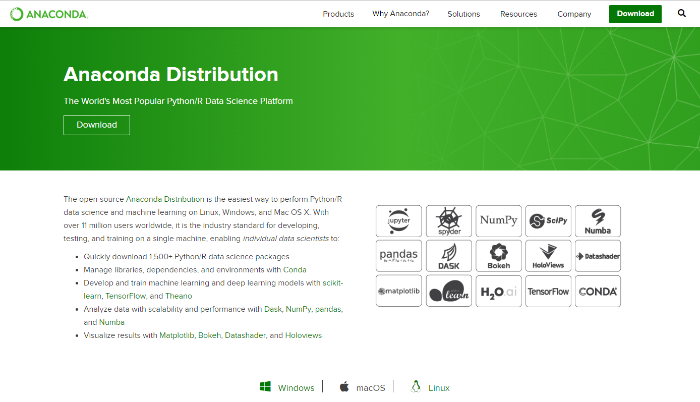

공식사이트에서 설치파일을 다운로드 합니다.

파이썬은 3.x와 2.x 두가지의 버전이 존재합니다. 버전을 선택합니다.

최신의 파이썬을 선택하고자 할때에는 3.x 를 선택합니다.

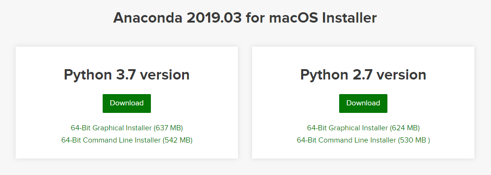

## 설치 시작

다운로드 받은 아나콘다를 설치 합니다.

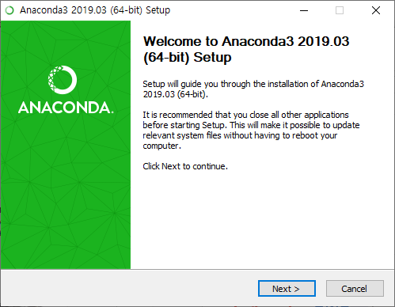

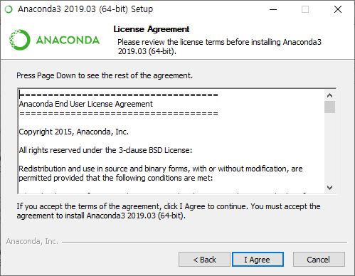

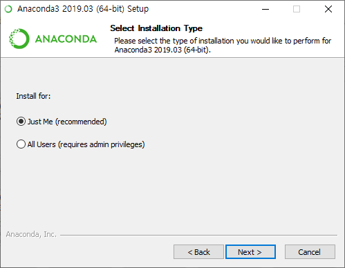

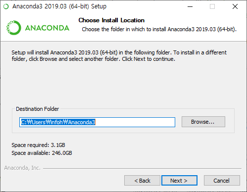

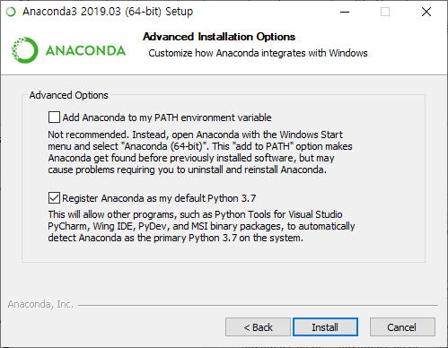

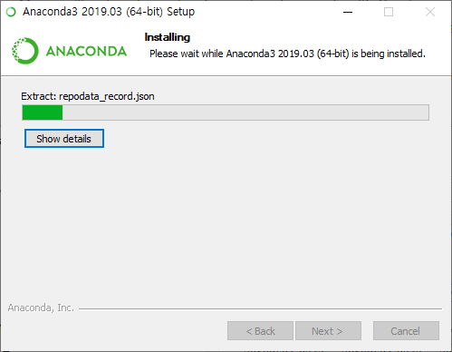

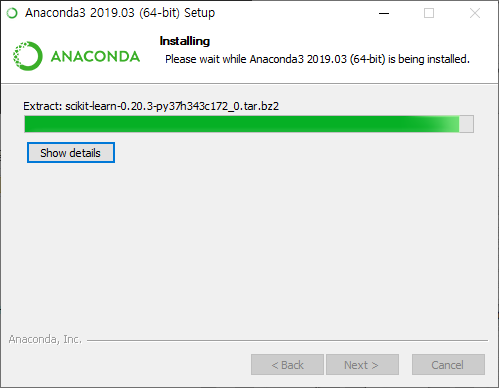

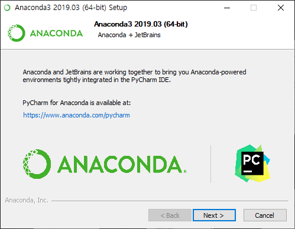

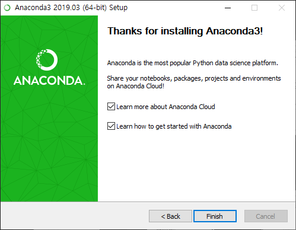

설치를 완료 하였습니다. 아나콘다 클라우드 페이지로 자동 접속이 됩니다. 아나콘다를 보다 다채롭게 사용을 하기 위해서 먼저 회원 가입을 해두도록 합니다.

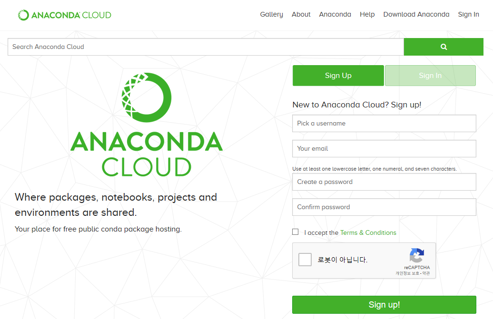